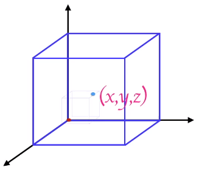

# Getting Started with Natural Language Processing with Python

## Getting Started

1. Install Python (Link)
2. Install PyCharm Community edition (JetBrain free IDE) (Link)
3. Install NLTK package. File > Settings > Project Settings > Add (+)

4. NLTK needs to download punkt. After import nltk, add nltk.download(‘punkt’). This line is not required anymore after done once.
5. Right click on file and Run

## Notes

Natural Language Processing (NPL): 
- Enable computers to derive meaning from natural language. 
- Example of use: Auto-tagging, autocomplete, auto-summarizing, classification of a book/articles in themes... sentimental Analysis (What is the market sentiment around Apple’s latest product launch? How are voters feeling towards a particular candidate? What do customers think about a particular brand?)

## Tasks in NLP

Tokenization
- Breaking down text into words and sentences

Stopword Removal
- Filtering common words

N-Grams
- Identifying commonly occurring groups of words
- Group of words which goes usually together
- Example: New York is a great city. Have you ever been to New York? -> New York is a bigram.

Word Sense Disambiguation
- Identifying the context in which the word occurs
- Different meaning depending on the context.
- Example: The movie had really cool effects. I would like a tall glass of cool water. 

Parts of Speech
- Identifying Part-of-Speech
- Determine if a word is a Noun, Verb, and Adverb…

Stemming
- Removing ends of the words
- When a word as same meaning but is treated differently because of their suffixes.
- Example: close, closed, closely, closer

[Example1.py](Example1.py)

## Rule vs ML

Filter spam emails from no spam emails (ham):
- Expressing rules are difficult to express for humans, but if you have historical data is available and Patters/Relationships are dynamic, then you can use ML.

### Rule-based approach

### ML-based approach

Step 1 - Pick you problem
- Identifying which type of problem we need to solve
- Pick your problem can fall into multiple categories. Two of these categories are classifications and clustering. 
- In a classification type of problem, we have a classifier (a set of instances for which the correct category membership is known) and training data. For instance tweets which are correctly classified as positive or negative (Sentiment Analysis), or spam detection (spam / ham category).
- In the case of clustering, the groups are unknown beforehand. The groups are determined by exploring the data, find patterns which exist in the data. The groups will then be labelled as themes, topics. 

Step 2 - Represent data
- Represent data using numeric attributes
- One way of doing this is by using the Term Frequency and TF-IDF methodologies.

Step 3 - Apply an algorithm
- Use a standard algorithm to find a model
- It will depend of the kind of problems: For classification: Naïve Bayes or SVM can be used for instance. For clustering: K-Means, hierarchical clustering

## Example - Auto-summarizing Text

In order to summarize a text, we will need to: 
- Find the most important words: authors tend to repeat the words which are more important. Most repeated words will define its importance. The higher the frequency, the higher the importance. It is important to remove the stop words, as they will be the ones repeated the most and confuse the auto summarizing algorithm.
- Compute significance score for sentences based on words they contain: give a weight on the most important words. Sum of all important words.
- Pick the top most significant sentences

[Example2.py](Example2.py)

### Classifying Text Using Machine Learning: Understanding the Clustering Workflow

**Step 1 - Pick your problem**

A cluster is a group. In the following example we are given a large number of articles, which would be divided into groups based on some common attributes. 

For clustering to work, we should be able to 
- maximise intra-cluster similarity: items in a group must be similar to one another 
- minimize inter-cluster similarity: items in different groups must be dissimilar to one another

**Step 2 - Represent your data**

Use meaningful numeric attributes to represent text, for instance, we could define our features the following way:

Then, we associate a frequency to it...:

This model is called Bags of Words. But here, the information on the order of words is lost.

The words which does not appear frequently across multiples articles, can be used to different a document from others: 

This is where we use the TF-IDF approach:

**Step 3 - Apply an algorithm**

For new article, we have a classic classification problem:
- Problem statement
- Features: represent the training data and test data using numerical attributes
- Training: train a model using the training data
- Test: test the model using test data

As a prerequisite for applying K-Means clustering, 
- Documents are represented using TF-IDF
- Each document is a tuple of N Numbers with N the total number of distinct words in all documents

Each tuple of N numbers can be represented as a point in a N-dimensional hypercube (a vector of N dimensions)

The distance between grp of points is used to create cluster. K is the number of clusters you want to group your points into.

- Replace recursively the centroids so it includes all points: this is convergence
- Point (3) means to find the new means / centroids of the clusters

[Example3.py](Example3.py)