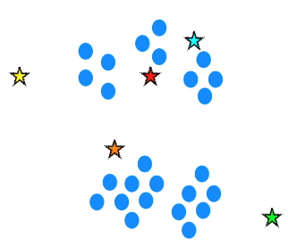
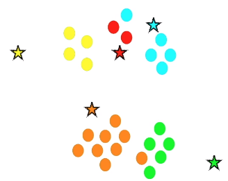

# Getting Started with Natural Language Processing with Python

## Installation

1. Install [Python](https://www.python.org/downloads/)
2. Install [PyCharm IDE - Community edition](https://www.jetbrains.com/pycharm/download/#section=windows)
3. Install NLTK package. File > Settings > Project Settings > Add (+)


4. NLTK needs to download punkt. After import nltk, add nltk.download(‘punkt’). This line is not required anymore after done once.
5. Right click on file and Run

## Natural Language Processing Concepts & Approaches

NLP allows computers to derive meaning from natural language.

### Usage

* Auto-tagging
* autocomplete
* auto-summarizing
* classification of a book/articles in themes
* sentimental Analysis: What is the market sentiment around Apple’s latest product launch? How are voters feeling towards a particular candidate? What do customers think about a particular brand?
* ...

### Main steps

[Example1.py](Example1.py)

Tokenization
- Breaking down text into words and sentences

Stopword Removal
- Filtering common words

N-Grams
- Identify commonly occurring groups of words that usually goes together
- Example: New York is a great city. Have you ever been to New York? -> New York is a bigram.

Word Sense Disambiguation
- Identifying the context in which the word occurs and infer its meaning
- Example: The movie had really cool effects. I would like a tall glass of cool water. 

Parts of Speech
- Determine if a word is a Noun, Verb, and Adverb...

Stemming
- Remove the end of some words, that keep same meaning without their suffixes
- Example: close, closed, closely, closer

### Rule vs ML

When filtering spam emails, we have two different approaches:


Expressing static rules can be tedious for humans, but if you have  some historical data available, ML can be used to find patterns/relationships dynamically.

### Strategy for ML

**Step 1 - Pick you problem**

You need to identify which type of problem we need to solve. It can fall into multiple categories, for instance classification and clustering. 
- Classsification: the groups/classes are known beforehand. We have a classifier (a set of instances for which the correct category membership is known) and training data. For instance tweets which are correctly classified as positive or negative (binary) or articles by pre-defined themes (multiple)
- Clustering: the groups are unknown beforehand. The groups are determined by exploring the data, find patterns which exist in the data. The groups will then be labelled as themes, topics. 

**Step 2 - Represent data using numeric attributes**

One way of doing this is by using the Term Frequency and TF-IDF methodologies.

**Step 3 - Apply an algorithm**

First start by a standard algorithm to find a model. It will depend of the kind of problems: For classification: Naïve Bayes or SVM can be used for instance. For clustering: K-Means, hierarchical clustering..

## Example 01 - Auto-summarizing Text

[Example2.py](Example2.py)

In order to summarize a text, we will need to: 
- Find the most important words: authors tend to repeat the words which are more important. Most repeated words will define its importance. The higher the frequency, the higher the importance. It is important to remove the stop words, as they will be the ones repeated the most and confuse the auto summarizing algorithm.
- Compute significance score for sentences based on words they contain: give a weight on the most important words. Sum of all important words.
- Pick the top most significant sentences

## Example 02 - Classifying Text Using ML Clustering Algorithm

[Example3.py](Example3.py)

**Step 1 - Pick your problem**

A cluster is a group. In the following example we are given a large number of articles, which would be divided into groups based on some common attributes. 

For clustering to work, we should be able to 
- maximise intra-cluster similarity: items in a group must be similar to one another 
- minimize inter-cluster similarity: items in different groups must be dissimilar to one another

**Step 2 - Represent your data**

Use meaningful numeric attributes to represent text, for instance, we could define our features by creating a list representing all the words that appears in any text:


Then, we associate a frequency to it...:


This model of **Term Frequency Representation** is called **Bags of Words**. But here, the information on the order of words is lost.

The words which does not occur more rarely, can be used to differentiate documents from each other. This is how we deduce the TF-IDF approach:

```
Weight = 1 / number of documents where the word is used
```

**Step 3 - Apply an algorithm**

We choose to use a clustering algorithm since we don't know the groups beforehand.

As a prerequisite for applying K-Means clustering, 
- Documents are represented using TF-IDF (historic data and new articles)
- Each document is a tuple of N Numbers with N the total number of distinct words in all documents

For every document of the historic set or for a new article, we will determine the K-Nearest Neighbors and choose depending on the number of neighboring items.


Each tuple of N numbers can be represented as 
- a tuple of N numbers
- a point in a N-dimensional hypercube 
-  vector of N dimensions


The distance between group of points is used to create cluster. K is the number of clusters you want to group your points into.

1. Initialize a set of points as the "K" means or centroids of the cluster



2. Assign each point to the nearest K means



3. Recalculate the new means of the cluster. This will replace recursively all the centroids so it includes all points: also called convergence. 


Repeat 2 and 3 until the mean don't change anymore. 